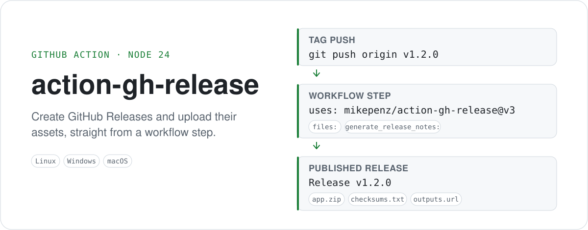

<h1 align="center">action-gh-release</h1>

<p align="center">
  <a href="https://github.com/mikepenz/action-gh-release/releases/latest"></a>
  <a href="https://github.com/mikepenz/action-gh-release/actions/workflows/main.yml"></a>
  <a href="https://github.com/mikepenz/action-gh-release/blob/main/LICENSE"></a>
  <a href="https://securityscorecards.dev/viewer/?uri=github.com/mikepenz/action-gh-release"></a>
</p>

<p align="center">
  <picture>
    <source media="(prefers-color-scheme: dark)" srcset="art/hero-dark.svg">
    
  </picture>
</p>

<p align="center">
  <a href="#-quickstart">Quickstart</a> •
  <a href="#-showcase">Showcase</a> •
  <a href="#reference">Reference</a> •
  <a href="#inputs">Inputs</a>
</p>

| | |
| --- | --- |
| 🚀 **One step, one release** | Creates or updates the release for a tag and uploads every matching asset. |
| 🌍 **Runs anywhere** | Linux, Windows and macOS runners — no Docker, `node24` JavaScript action. |
| 📝 **Release notes included** | `generate_release_notes`, `body`, `body_path`, or append to what is already there. |
| 📦 **Glob-based assets** | Newline-delimited globs, uploaded in parallel, optionally in a fixed order. |
| 🛟 **Safe under concurrency** | Uploads into a draft, then publishes — and `on_tag_conflict` handles a racing job. |
| 🔗 **Usable outputs** | `url`, `id`, `upload_url`, and a JSON `assets` array for downstream steps. |

## 🚀 Quickstart

**1. Grant the job permission to write releases**

```yaml
permissions:
  contents: write
```

**2. Add the step, gated on a tag push**

```yaml
name: Main

on: push

jobs:
  build:
    runs-on: ubuntu-latest
    permissions:
      contents: write
    steps:
      - name: Checkout
        uses: actions/checkout@v4
      - name: Release
        uses: mikepenz/action-gh-release@v3
        if: startsWith(github.ref, 'refs/tags/')
        with:
          generate_release_notes: true
          files: |
            build/*.zip
            build/checksums.txt
```

**3. Push a tag**

```bash
git tag v1.2.0 && git push origin v1.2.0
```

The release is created as a draft, the assets are uploaded, and it is published once
they are all there. See [inputs](#inputs) for everything you can customize.

## 📸 Showcase

<p align="center">
  
</p>

> The screenshot above is captured by hand and needs a manual refresh when the GitHub
> release UI changes. The hero above it is generated and always matches this README.

---

# Reference

| Topic | |
| --- | --- |
| [Usage](#-usage) | Tag gating and the shape of a typical workflow |
| [Inputs](#inputs) | Every `with:` key |
| [Outputs](#outputs) | Values other steps can read |
| [Environment variables](#environment-variables) | Deprecated `env:` fallbacks |
| [Permissions](#permissions) | Token scopes the action needs |
| [Fork](#fork) | Relationship to the upstream action |

## 🤸 Usage

### 🚥 Limit releases to pushes to tags

Typically usage of this action involves adding a step to a build that
is gated pushes to git tags. You may find `step.if` field helpful in accomplishing this
as it maximizes the reuse value of your workflow for non-tag pushes.

Below is a simple example of `step.if` tag gating

```yaml
name: Main

on: push

jobs:
  build:
    runs-on: ubuntu-latest
    steps:
      - name: Checkout
        uses: actions/checkout@v4
      - name: Release
        uses: mikepenz/action-gh-release@{latest}
        if: startsWith(github.ref, 'refs/tags/')
```

### 💅 Customizing

#### inputs

The following are optional as `step.with` keys

| Name                       | Type    | Description                                                                                                                                                                                                                                                                                                                                                                                                                                     |
| -------------------------- | ------- | ----------------------------------------------------------------------------------------------------------------------------------------------------------------------------------------------------------------------------------------------------------------------------------------------------------------------------------------------------------------------------------------------------------------------------------------------- |
| `body`                     | String  | Text communicating notable changes in this release                                                                                                                                                                                                                                                                                                                                                                                              |
| `body_path`                | String  | Path to load text communicating notable changes in this release                                                                                                                                                                                                                                                                                                                                                                                 |
| `draft`                    | Boolean | Indicator of whether or not this release is a draft                                                                                                                                                                                                                                                                                                                                                                                             |
| `prerelease`               | Boolean | Indicator of whether or not is a prerelease                                                                                                                                                                                                                                                                                                                                                                                                     |
| `files`                    | String  | Newline-delimited globs of paths to assets to upload for release                                                                                                                                                                                                                                                                                                                                                                                |
| `working_directory`        | String  | Base directory to resolve the `files` globs against. Defaults to the job working directory                                                                                                                                                                                                                                                                                                                                                      |
| `overwrite_files`          | Boolean | Overwrite existing release assets with the same name. Defaults to `true`                                                                                                                                                                                                                                                                                                                                                                        |
| `preserve_order`           | Boolean | Upload the assets sequentially so their order on the release matches the `files` order                                                                                                                                                                                                                                                                                                                                                          |
| `concurrency`              | String  | Maximum number of assets to upload in parallel. Defaults to `4`. Ignored when `preserve_order` is `true`                                                                                                                                                                                                                                                                                                                                        |
| `name`                     | String  | Name of the release. defaults to tag name                                                                                                                                                                                                                                                                                                                                                                                                       |
| `tag_name`                 | String  | Name of a tag. defaults to `github.ref`                                                                                                                                                                                                                                                                                                                                                                                                         |
| `fail_on_unmatched_files`  | Boolean | Indicator of whether to fail if any of the `files` globs match nothing                                                                                                                                                                                                                                                                                                                                                                          |
| `fail_on_asset_upload_issue`  | Boolean | Indicator of whether to fail if any of the `assets` fails to upload                                                                                                                                                                                                                                                                                                                                                                          |
| `repository`               | String  | Name of a target repository in `<owner>/<repo>` format. Defaults to GITHUB_REPOSITORY env variable                                                                                                                                                                                                                                                                                                                                              |
| `target_commitish`         | String  | Commitish value that determines where the Git tag is created from. Can be any branch or commit SHA. Defaults to repository default branch.                                                                                                                                                                                                                                                                                                      |
| `draft_during_upload` | Boolean | Create the release as a draft and publish it after the assets are uploaded. Defaults to `true`. Set to `false` to create it published up front, which shrinks the window for a concurrent job to claim the tag, at the cost of the release being visible while assets still upload. Ignored when `draft` is `true`.                                                                                                          |
| `on_tag_conflict`     | String  | Behaviour when another job published a release for the same tag while this action was running. `update` (default) switches to updating that release and re-uploads the assets onto it, `fail` aborts the action.                                                                                                                                                                                                            |
| `make_latest`         | String  | Configuration to make the new release the latest. Defaults to 'true'. Can be one of: 'true', 'false', 'legacy' branch.                                                                                                                                                                                                                                                                                                      |
| `token`                    | String  | Secret GitHub Personal Access Token. Defaults to `${{ github.token }}`                                                                                                                                                                                                                                                                                                                                                                          |
| `discussion_category_name` | String  | If specified, a discussion of the specified category is created and linked to the release. The value must be a category that already exists in the repository. For more information, see ["Managing categories for discussions in your repository."](https://docs.github.com/en/discussions/managing-discussions-for-your-community/managing-categories-for-discussions-in-your-repository)                                                     |
| `generate_release_notes`   | Boolean | Whether to automatically generate the name and body for this release. If name is specified, the specified name will be used; otherwise, a name will be automatically generated. If body is specified, the body will be pre-pended to the automatically generated notes. See the [GitHub docs for this feature](https://docs.github.com/en/repositories/releasing-projects-on-github/automatically-generated-release-notes) for more information |
| `previous_tag`             | String  | When `generate_release_notes` is `true`, use this tag as the starting point instead of letting GitHub auto-detect the previous release                                                                                                                                                                                                                                                                                                           |
| `append_body`              | Boolean | Append to existing body instead of overwriting it                                                                                                                                                                                                                                                                                                                                                                                               |

💡 When providing a `body` and `body_path` at the same time, `body_path` will be
attempted first, then falling back on `body` if the path can not be read from.

💡 When the release info keys (such as `name`, `body`, `draft`, `prerelease`, etc.)
are not explicitly set and there is already an existing release for the tag, the
release will retain its original info.

#### outputs

The following outputs can be accessed via `${{ steps.<step-id>.outputs }}` from this action

| Name         | Type   | Description                                                                                                                                                                                                |
| ------------ | ------ | ---------------------------------------------------------------------------------------------------------------------------------------------------------------------------------------------------------- |
| `url`        | String | Github.com URL for the release                                                                                                                                                                             |
| `id`         | String | Release ID                                                                                                                                                                                                 |
| `upload_url` | String | URL for uploading assets to the release                                                                                                                                                                    |
| `assets`     | String | JSON array containing information about each uploaded asset, in the format given [here](https://docs.github.com/en/rest/releases/assets#get-a-release-asset) (minus the `uploader` field) |

As an example, you can use `${{ fromJSON(steps.<step-id>.outputs.assets)[0].browser_download_url }}` to get the download URL of the first asset.

#### environment variables

The following `step.env` keys are allowed as a fallback but deprecated in favor of using inputs.

| Name                | Description                                                                                |
| ------------------- | ------------------------------------------------------------------------------------------ |
| `GITHUB_TOKEN`      | GITHUB_TOKEN as provided by `secrets`                                                      |
| `GITHUB_REPOSITORY` | Name of a target repository in `<owner>/<repo>` format. defaults to the current repository |

> **⚠️ Note:** This action was previously implemented as a Docker container, limiting its use to GitHub Actions Linux virtual environments only. With recent releases, we now support cross platform usage. You'll need to remove the `docker://` prefix in these versions

### Permissions

This Action requires the following permissions on the GitHub integration token:

```yaml
permissions:
  contents: write
```

When used with `discussion_category_name`, additional permission is needed:

```yaml
permissions:
  contents: write
  discussions: write
```

[GitHub token permissions](https://docs.github.com/en/actions/security-guides/automatic-token-authentication#permissions-for-the-github_token) can be set for an individual job, workflow, or for Actions as a whole.

## Fork

This is a fork from https://github.com/softprops/action-gh-release with various patches and modifications applied - Please refer to the original action for any questions.

Doug Tangren (softprops) 2019
